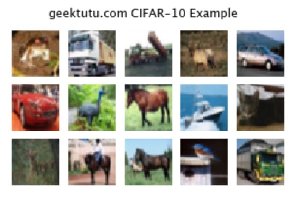

**TF2.0 TensorFlow 2 / 2.0 中文文档：TFHub 迁移学习 transfer learning**

主要内容：使用 [TFHub](https://www.tensorflow.org/hub) 中的预训练模型 _ImageNet_ 进行迁移学习，实现图像分类，数据集使用 CIFAR-10。

## ImageNet 模型简介

TFHub 上有很多预训练好的模型(pretrained model)，这次我们选择`ImageNet`。ImageNet 数据集大约有1500万张图片，2.2万类，可以说你能想到，想象不到的图片都能在里面找到。想下载感受一下的话可以到官网下载[ImageNet](http://www.image-net.org/)。

当然每次训练不太可能使用所有的图片，一般使用子集，比如2012年ILSVRC分类数据集使用了大概1/10的图片。我们今天用于迁移学习的预训练模型就只有1001个分类，想知道这1001类分别有哪些可以看[这里](https://storage.googleapis.com/download.tensorflow.org/data/ImageNetLabels.txt)。

### 下载  ImageNet Classifier
 
```python
# geektutu.com
import numpy as np
from PIL import Image
import matplotlib.pylab as plt
import tensorflow as tf
import tensorflow_hub as hub
from tensorflow.keras import layers, datasets

url ="https://tfhub.dev/google/tf2-preview/mobilenet_v2/classification/4"
model = tf.keras.Sequential([
    hub.KerasLayer(url, input_shape=(224, 224, 3))
])
```

ImageNet 数据集中的图片大小固定为 (224, 224, 3)，因此模型的输入也是 (224, 224, 3)。

### 测试任意图片

在这里选取一张兔子的图片，也就是本站的 logo 来测试这个预训练好的模型。

```python
# geektutu.com
tutu = tf.keras.utils.get_file('tutu.png','https://geektutu.com/img/icon.png')
tutu = Image.open(tutu).resize((224, 224))
tutu
```


```python
# geektutu.com
result = model.predict(np.array(tutu).reshape(1, 224, 224, 3)/255.0)
ans = np.argmax(result[0], axis=-1)
print('result.shape:', result.shape, 'ans:', ans)
# result.shape: (1, 1001) ans: 332
```

模型的输出有1001个分类，测试的结果是332，接下来我们将下载 _ImageNetLabels.txt_ ，就可以知道332代表的分类的名称，可以看到结果是 hare，即`兔`。

```python
# geektutu.com
labels_url = 'https://storage.googleapis.com/download.tensorflow.org/data/ImageNetLabels.txt'
labels_path = tf.keras.utils.get_file('ImageNetLabels.txt', labels_url)
imagenet_labels = np.array(open(labels_path).read().splitlines())
print(imagenet_labels[ans])
# hare
```

## 迁移学习

在实际的应用中，预训练好的模型的输入输出可能并不能满足我们的需求，另外，训练上百万甚至上千万张图片，可能需要花费好几天的时间，那有没有办法只使用训练好的模型的一部分呢？训练好的模型的前几层对特征提取有非常好的效果，如果可以直接使用，那就事半功倍了。这种方法被称之为迁移学习(transfer learning)。

在接下来的例子中，我们复用了  _ImageNet Classifier_  的特征提取的部分，并定义了自己的输出层。因为原来的模型输出是1001个分类，而我们希望识别的 CIFAR-10 数据集只有10个分类。

### resize 数据集

这次demo使用的是 CIFAR-10 数据集，这个数据集在上篇文档 [卷积神经网络分类 CIFAR-10](https://geektutu.com/post/tf2doc-cnn-cifar10.html)有比较详细的介绍，这里就不重复介绍了。再简单看一看这个数据集中的15张样例图片。



 _ImageNet Classifier_ 的输入固定为(224, 224, 3)，但 CIFAR-10 数据集中的图片大小是 32 * 32，简单起见，我们将每一张图片大小从 32x32 转换为 224x224，使用`pillow`库提供的 resize 方法。因为读取全部的数据，内存会被撑爆，所以训练集只截取了 30,000 张图片。

```python
def resize(d, size=(224, 224)):
    return np.array([np.array(Image.fromarray(v).resize(size, Image.ANTIALIAS))
                     for i, v in enumerate(d)])

(train_x, train_y), (test_x, test_y) = datasets.cifar10.load_data()
train_x, test_x = resize(train_x[:30000])/255.0, resize(test_x)/255.0
train_y = train_y[:30000]
```

### 下载特征提取层

TFHub 提供了 _ImageNet Classifier_ 去掉了最后的分类层的版本，可以直接下载使用。

```python
feature_extractor_url = 'https://tfhub.dev/google/tf2-preview/mobilenet_v2/feature_vector/4'
feature_extractor_layer = hub.KerasLayer(feature_extractor_url,
                                         input_shape=(224,224,3))
# 这一层的训练值保持不变
feature_extractor_layer.trainable = False
```

### 添加分类层

```python
model = tf.keras.Sequential([
    feature_extractor_layer,
    layers.Dense(10, activation='softmax')
])
model.compile(optimizer=tf.keras.optimizers.Adam(),
              loss='sparse_categorical_crossentropy',
              metrics=['acc'])
model.summary()
```

这一步，我们在特征提取层后面，添加了输出为10的全连接层，用于最后的分类。从`model.summary()`中我们可以看到特征提取层的输出是1280。

```
Model: "sequential_1"
_________________________________________________________________
Layer (type)                 Output Shape              Param #   
=================================================================
keras_layer_1 (KerasLayer)   (None, 1280)              2257984   
_________________________________________________________________
dense (Dense)                (None, 10)                12810     
=================================================================
Total params: 2,270,794
Trainable params: 12,810
Non-trainable params: 2,257,984
_________________________________________________________________
```

### 训练并评估模型

```python
history = model.fit(train_x, train_y, epochs=1)
loss, acc = model.evaluate(test_x, test_y)
print(acc)
```

```bash
10000/10000 [=====] - 256s 26ms/sample - loss: 0.7636 - acc: 0.7657
```

本文的示例模型非常简单，在`feature_extractor_layer`直接添加了输出层，可训练参数很少。而且只使用大约一半的训练集，正确率仍然达到了 76% 。

类似于 ImageNet 的预训练模型还有很多，比如非常出名的 VGG 模型，有兴趣都可以尝试。

返回[文档首页](https://geektutu.com/post/tf2doc.html)

> 完整代码：[Github - tfhub_image_transfer_learning.ipynb](https://github.com/geektutu/tensorflow2-docs-zh/tree/master/code)
> 参考文档：[TensorFlow Hub with Keras](https://www.tensorflow.org/beta/tutorials/images/hub_with_keras)